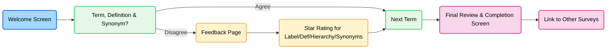

# HPO Term Survey 

A Vue.js-based survey tool for collecting and reviewing responses about sleep-related terms and concepts. The app includes interactive components such as star ratings, synonym selection, and hierarchical term review, designed to support structured feedback and analysis.

## Overview 

### Purpose / Goal

- Collect structured feedback on HPO (Human Phenotype Ontology) terms.

- Evaluate user understanding of term definitions, synonyms, and hierarchical relationships.

- Support research or ontology refinement by gathering qualitative and quantitative data.


### Survey flow 



### Key Features 

- Interactive term review with agree/disagree options.

- Star rating system for labels, definitions, hierarchy, and synonyms.

- Synonym selection to propose or confirm alternative term labels.

- Hierarchical navigation of terms to show relationships.

- Syncronized with Airtable for easy data storage.

- Links to other related surveys at the end.

## Getting Started

First start by cloning the repo

```bash 
git clone REPO HERE
```

This project requires **Node.js** and a package manager (**npm** or **Yarn**) to install dependencies and run the app.

### 1. Install Node.js and npm

macOS / Linux (using Homebrew):

```bash
# Install Homebrew if you don't have it
/bin/bash -c "$(curl -fsSL https://raw.githubusercontent.com/Homebrew/install/HEAD/install.sh)"

# Install Node.js (includes npm)
brew install node

# Verify installation
node -v
npm -v
```
Windows:
Download the Node.js installer from https://nodejs.org and follow the prompts. npm is included automatically.

### 2. Install Yarn (optional, alternative to npm)

```bash
# Using Homebrew (macOS)
brew install yarn

# Using npm
npm install --global yarn

# Verify installation
yarn -v
```

### 3. Install Dependencies 

```bash 
npm install
```
or 
```bash
yarn install
```

### 4. Create a .env File to Hold Api keys

```bash
touch .env
```
Then inside of this file place your api keys for Airtable.
 - Note: your Api key will need read and write access for this to work

```
VITE_AIRTABLE_API_KEY=xxxxxxx
VITE_AIRTABLE_BASE_ID=xxxxxxx
VITE_AIRTABLE_TABLE_CONTRIBUTORS=xxxxxxx
VITE_AIRTABLE_TABLE_TERMS=xxxxxxx
VITE_AIRTABLE_TABLE_RESPONSES=xxxxxxxx
VITE_AIRTABLE_TABLE_SYNONYMS=xxxxxxx
```

### 5. Running Locally

```bash 
npm run dev
```
or 
```bash
yarn dev
```

### 6. Building Output Files 

```bash 
npm run build
```
or 
```bash
yarn build 
```
This will create a `dist` folder that contains your `index.html` and an `assets` folder with all compiled source files.

## Project Structure 

```
HPO-Term-Survey/
├── package.json
├── package-lock.json / yarn.lock
├── public/
│   └── index.html
├── src/
│   ├── App.vue
│   ├── main.js
│   ├── assets/
│   │   └── style.css
│   ├── components/
│   │   ├── Disagree.vue
│   │   ├── Finish.vue
│   │   ├── HierarchyNode.vue
│   │   ├── Review.vue
│   │   ├── StarRating.vue
│   │   ├── SynonymSelector.vue
│   │   ├── Terms.vue
│   │   └── Welcome.vue
│   │   └── readme/
│   ├── router/
│   │   └── index.js
│   ├── storage/
│   │   ├── storeSurvey.js
│   │   └── README.md
│   └── utils/
│       ├── hierarchyUtils.js
│       ├── synonymUtils.js
│       └── README.md
└── README.md
```

### Component READMEs

To learn more about the different components inside the `src` folder check the readmes below. 

- [Disagree.vue](src/components/readme/Disagree.md)
- [Finish.vue](src/components/readme/Finish.md)
- [HierarchyNode.vue](src/components/readme/HierarchyNode.md)
- [Review.vue](src/components/readme/Review.md)
- [StarRating.vue](src/components/readme/StarRating.md)
- [SynonymSelector.vue](src/components/readme/SynonymSelector.md)
- [Terms.vue](src/components/readme/Terms.md)
- [Welcome.vue](src/components/readme/Welcome.md)

### Storage and Utils READMEs

- [storage/README.md](src/storage/README.md)
- [utils/README.md](src/utils/README.md)

## Contribuitions

A Special Thank You To: 

- Alexander Collier {akcol@med.umich.edu}
- Anastasia Yocum {akyocum@med.umich.edu}
- Claudia Diaz-Byrd {diazbyrc@med.umich.edu}
- Melvin Mcinnis {mmcinnis@med.umich.edu}

For Your Contributions To The Project. 